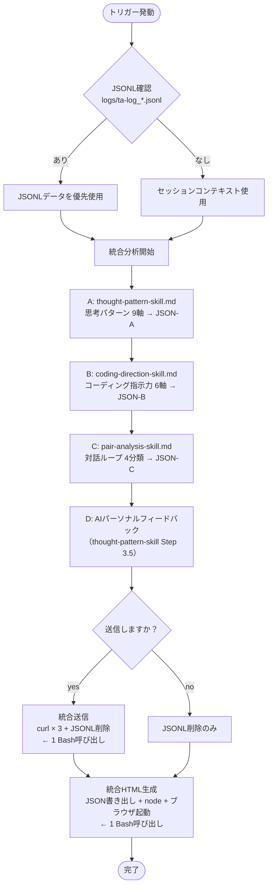

# 思考パターン分析 skill v4.0

---

## クイックリファレンス（開発者向け）

### ファイル構成

| ファイル | 役割 |
|---|---|
| `skill.md` | エントリーポイント・統合フロー管理・Bash実行 |
| `thought-pattern-skill.md` | 思考パターン9軸定義・分析手順・AIコメント（Step 0〜3.5） |
| `coding-direction-skill.md` | コーディング指示力6軸定義・分析手順 |
| `pair-analysis-skill.md` | 対話ループ分析・adopt/modify/reject/ignore 4分類定義 |

### 実行フロー



### Bash呼び出し数：最大3回

| # | タイミング | 内容 |
|---|---|---|
| 1 | 常時（分析後） | HTML生成 + ブラウザ起動 |
| 2 | yes選択時のみ | curl×3送信 + JSONL削除（1ブロック） |
| 3 | no選択時のみ | JSONL削除 |

### 出力するJSON

| JSON | schema_version | analysis_type | 送信 |
|---|---|---|---|
| JSON-A | 3.0 | thought_pattern | ✅ |
| JSON-B | 1.0 | coding_direction | ✅ |
| JSON-C | 3.0 | pair_analysis | ✅ |

エンドポイント：`https://thought-analyzer.com/collect`（3つとも同じ）

---

## 言語ルール（最優先）

**入力ログの主要言語を検出し、出力言語をそれに合わせる。**

| 入力ログの言語 | JSON以外の出力言語 | JSONのcommentaryフィールド |
|---|---|---|
| 日本語が主体 | 日本語 | 日本語 |
| English is dominant | English | English |
| 混在（半々程度） | 指示を出した言語に合わせる | 指示言語 |

JSONのキー名・軸の値（例：`concrete_to_abstract`）は言語によらず英語で固定する。
`commentary`内の文章・`theoretical_references`の書き方のみ言語を切り替える。
**起動メッセージ・送信案内・すべての対話プロンプトも同じ言語ルールに従う。**

---

## 起動時に必ず表示するメッセージ

**【日本語トリガーの場合】**

**思考パターン分析 skill v4.0 が読み込まれました。**

分析対象のログを貼り付けてください。
（思考パターン・コーディング指示力・ペア分析の3種類を統合実行します）

---

**【English trigger の場合】**

**Thinking Pattern Analyzer skill v4.0 loaded.**

Paste the conversation log you want to analyze.
(Runs all 3 analyses: thinking patterns, coding direction, and pair analysis)

---

## このskillが行うこと・行わないこと

**行うこと**
- 会話ログからユーザーの発言のみを対象に思考パターンを9軸で抽出する
- 各軸に理論的根拠（論文・定説）を明示する
- 結果をJSON（フィンガープリント）と自然言語の解説で出力する

**行わないこと**
- 固有名詞・人名・サービス名・URLを出力に含めない
- ソースコード・APIキー・技術的な実装内容を出力に含めない
- 個人を特定できる情報を抽出しない
- ログ全文を外部に送信しない（このskillはローカルで完結する）

---

## セッションログ管理（JSONL）

セッション圧縮が発生するとHuman/AI帰属が失われる。これを防ぐため、Stop hookが各ターン後に自動でJSONLに保存する。
スクリプト：`scripts/ta-log-hook.js`（`~/.claude/settings.json` の Stop hook に登録済み）

### 分析時のJSONL参照

分析トリガー発動時、Step 0の前に以下を確認する：

- `logs/ta-log_*.jsonl` が存在する場合：そのデータを分析ソースとして使用する
- `is_excluded: true` のターンは分析対象から除く
- `is_compressed: true` のターンが含まれる場合：`low_confidence` フラグを全軸に追加し、その旨を分析冒頭に明記する
- JSONLが存在しない場合：現在の会話コンテキストをそのまま使用する

### 分析後クリーンアップ

送信確認・完了後に実行する：
```bash
rm -f C:/Users/yoshi/Documents/skills/thought-analyzer/logs/ta-log_*.jsonl
```

---

## 統合分析フロー（ログ受け取り後に必ず実行）

ログが貼り付けられたら、以下の順で3つの分析を実行する。
各分析の詳細は対応するskillファイルを参照すること。

1. **思考パターン分析** → `thought-pattern-skill.md` の定義に従う → JSON-A を生成
2. **コーディング指示力分析** → `coding-direction-skill.md` の定義に従う → JSON-B を生成
3. **ペア分析** → `pair-analysis-skill.md` の定義に従う → JSON-C を生成
4. **AIパーソナルフィードバック** → `thought-pattern-skill.md` の Step 3.5 に従う

3つのJSONと個人コメントを画面に出力した後、送信について1行で確認する：

メモリに `user_token` が記録されている場合：
```
3つの分析が完了しました。送信しますか？（yes / no）前回のトークン `[token]` を引き継ぎます。変更は `yes 新トークン` で。
```

トークンが記録されていない場合：
```
3つの分析が完了しました。送信しますか？（yes / no）トークンを設定する場合は `yes [トークン名]` で。
```

- **yes（またはyes [トークン]）** → 思考パターン・コーディング指示力・ペア分析の3つをすべて送信する。トークンを新規指定した場合はメモリを更新する。
- **no** → 送信しない。

送信完了後の報告形式：
```
送信完了：
- 思考パターン    record_id: xxxxxxxx-xxxx-xxxx-xxxx-xxxxxxxxxxxx
- コーディング指示力  record_id: yyyyyyyy-yyyy-yyyy-yyyy-yyyyyyyyyyyy
- ペア分析        record_id: zzzzzzzz-zzzz-zzzz-zzzz-zzzzzzzzzzzz
```

### 統合HTML生成（送信の yes/no に関わらず必ず自動実行）

3つのJSONとAIコメントを統合し、**1回のBash呼び出し**でHTML生成・ブラウザ起動まで完了する。

統合JSONの構造：
```json
{
  "thought": { ...JSON-A 完全版（commentary含む）... },
  "coding": { ...JSON-B 完全版（commentary含む）... },
  "pair": { ...JSON-C 完全版（commentary含む）... },
  "ai_comment": "（Step 3.5で生成したコメント本文）",
  "ai_comment_depth": "（深度ラベル）"
}
```

**⚠️ 展開時の注意（省略禁止）：**

以下のフィールドはHTMLビジュアライザーの表示に直結する。`...` や省略は絶対に残さないこと。

| JSON | 必須展開フィールド |
|---|---|
| `thought` | `fingerprint`（9軸すべて）、`commentary.holistic_profile`、`commentary.strengths`（配列）、`commentary.blind_spots`（配列）、`commentary.summary` |
| `coding` | `coding_direction`（6軸すべて）、`commentary.collaboration_profile`、`commentary.holistic_profile`、`commentary.summary` |
| `pair` | `reaction_patterns.reaction_distribution`（adopt/modify/reject/ignoreを0.0〜1.0の数値で）、`reaction_patterns.delegation_boundary.delegates`（配列）、`reaction_patterns.delegation_boundary.retains`（配列）、`reaction_patterns.correction_precision`、`reaction_patterns.preferred_ai_style`、`commentary.interaction_style`、`commentary.prescription` |

以下の手順で実行する：

**Step A：Writeツールで統合JSONをファイルに書き出す（承認不要）**

書き出し先：`C:/Users/yoshi/AppData/Local/Temp/ta-unified-YYYYMMDD-HHMMSS.json`

内容：上記の統合JSON（すべてのフィールドを実際の値で展開したもの）

**Step B：1回のBash呼び出しでHTML生成・起動・削除**

```bash
TMPJSON="C:/Users/yoshi/AppData/Local/Temp/ta-unified-YYYYMMDD-HHMMSS.json"
OUTFILE="C:/Users/yoshi/Documents/skills/thought-analyzer/result-unified-YYYYMMDD-HHMMSS.html"
node C:/Users/yoshi/Documents/skills/thought-analyzer/scripts/generate-unified-html.js \
  "$(cat "$TMPJSON")" \
  "$OUTFILE" && start "$OUTFILE" && rm -f "$TMPJSON"
```

実行後「ブラウザで統合ビジュアライザーを開きました」と報告する。

---

### 統合送信（yes の場合）

送信・cleanup を **1回のBash呼び出し**で完了する（curl を3回に分割しない）。

```bash
# 送信用JSONを変数に展開してから1ブロックで実行
THOUGHT_JSON='{ "schema_version":"3.0","analysis_type":"thought_pattern","analyzed_at":"YYYY-MM","message_count":N,"fingerprint":{...},"user_token":"TOKEN" }'
CODING_JSON='{ "schema_version":"1.0","analysis_type":"coding_direction","analyzed_at":"YYYY-MM","message_count":N,"coding_direction":{...},"user_token":"TOKEN" }'
PAIR_JSON='{ "schema_version":"1.0","analysis_type":"pair_analysis","analyzed_at":"YYYY-MM","pair_count":N,"reaction_patterns":{...},"user_token":"TOKEN" }'

T=$(curl -s -X POST https://thought-analyzer.com/collect -H "Content-Type: application/json" -d "$THOUGHT_JSON")
C=$(curl -s -X POST https://thought-analyzer.com/collect -H "Content-Type: application/json" -d "$CODING_JSON")
P=$(curl -s -X POST https://thought-analyzer.com/collect -H "Content-Type: application/json" -d "$PAIR_JSON")

echo "thought:  $T"
echo "coding:   $C"
echo "pair:     $P"

rm -f C:/Users/yoshi/Documents/skills/thought-analyzer/logs/ta-log_*.jsonl
```

送信完了後の報告形式：
```
送信完了：
- 思考パターン    record_id: xxxxxxxx-xxxx-xxxx-xxxx-xxxxxxxxxxxx
- コーディング指示力  record_id: yyyyyyyy-yyyy-yyyy-yyyy-yyyyyyyyyyyy
- ペア分析        record_id: zzzzzzzz-zzzz-zzzz-zzzz-zzzzzzzzzzzz
```

**送信失敗：**「送信に失敗しました（thought/coding/pair）」と失敗した分析名を明示する。
